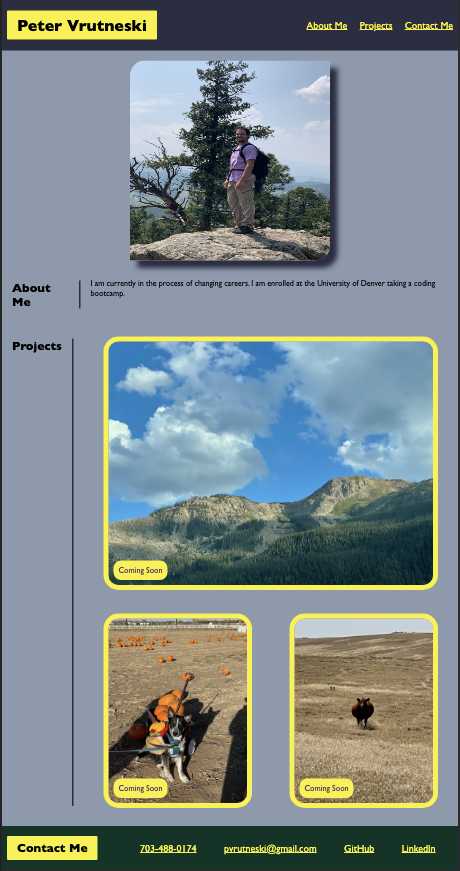

# Portfolio

## Link to live page

https://boopdid.github.io/Portfolio/

## Overview

This is a portfolio page I created to show the skills I have learned so far in my coding bootcamp. It contains an about me, my projects (currently they are only placeholders) and ways to contact me.

## Preview

## Technologies Used

- HTML
- CSS

In this project I used semantic HTML to construct my portfolio page. I also used CSS concepts such as flex, grid, and media queries to create a responsive page.
